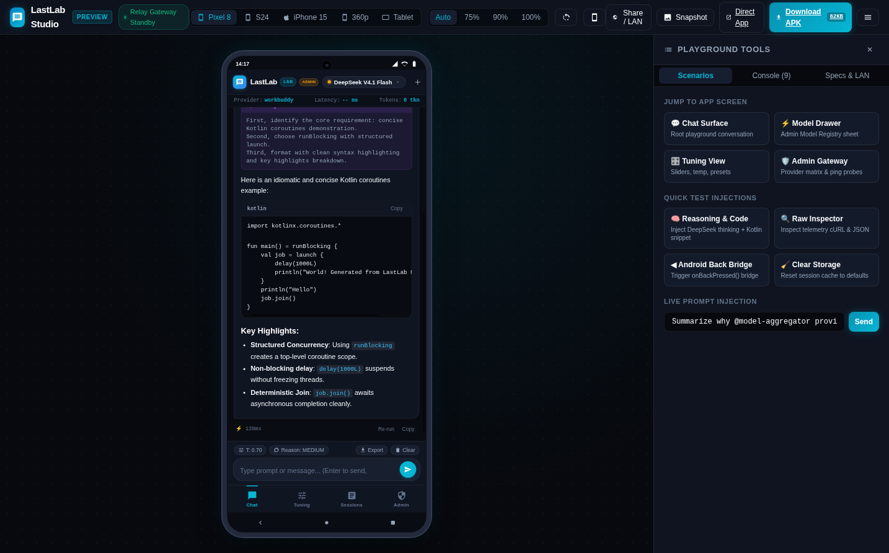
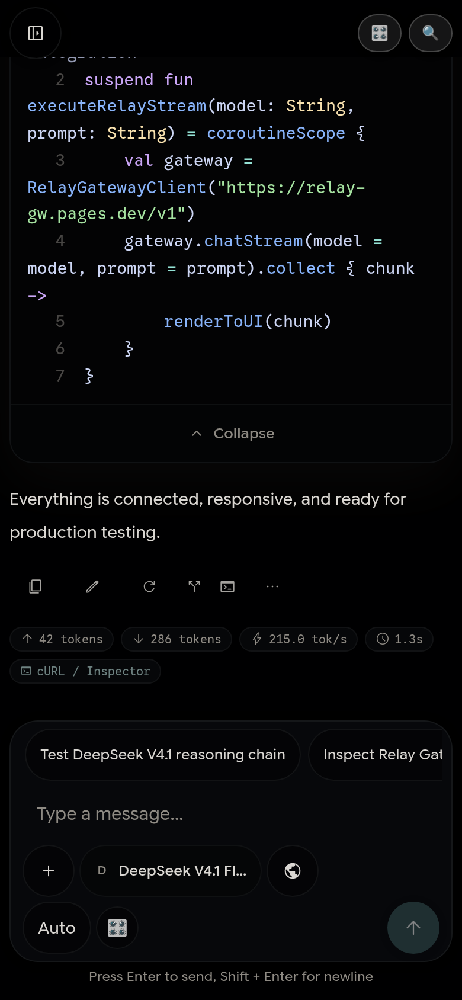
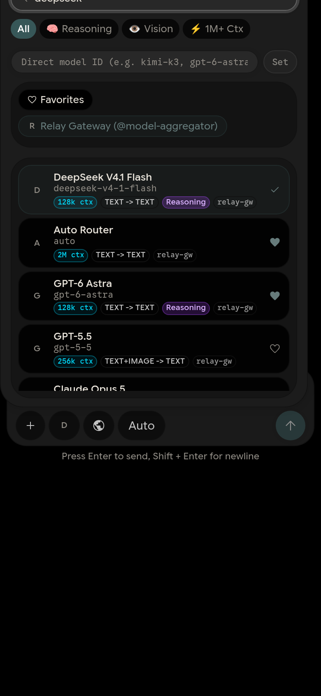
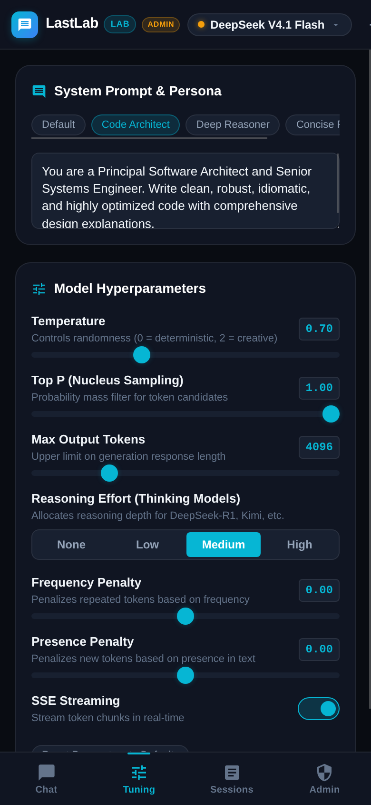
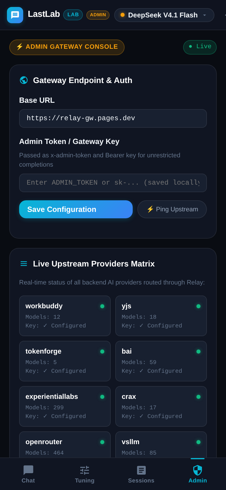
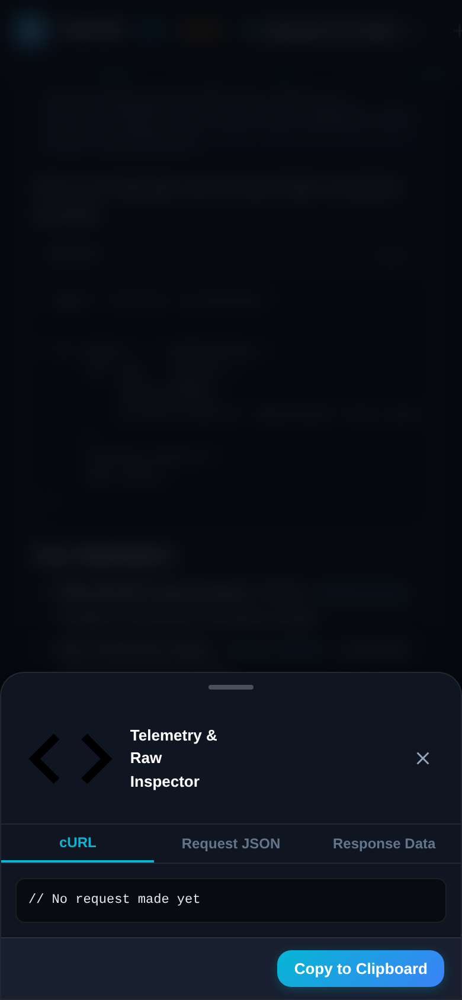
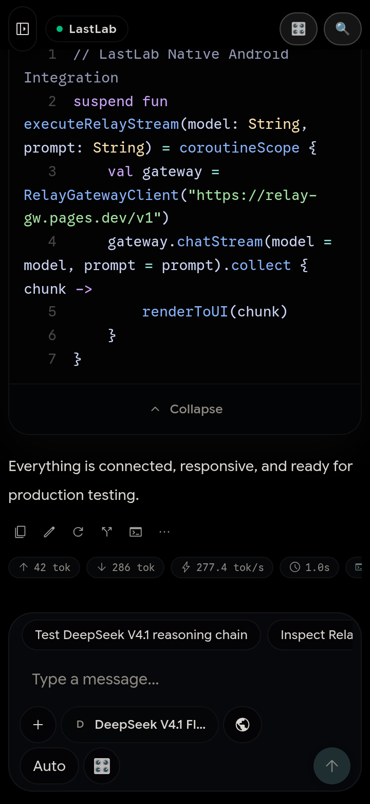

<div align="center">

# 🔬 LastLab

### High-Density AI Mobile Playground & Admin Console
*Single-provider architecture powered exclusively by the **Relay Gateway** (`@model-aggregator`)*

<br>

[-3DDC84?style=for-the-badge&logo=android&logoColor=white)](dist/lastlab.apk)
[](dist/lastlab.apk)
[](#-zero-dependency-headless-apk-toolchain)
[](#-zero-dependency-headless-apk-toolchain)
[](#-relay-gateway-architecture)
[](#-zero-dependency-headless-apk-toolchain)

<br>

[⬇️ **Download Android APK (`lastlab.apk`)**](dist/lastlab.apk) &nbsp;•&nbsp;
[📱 **Launch Preview Studio**](#-preview-anywhere-mobile-studio-simulator) &nbsp;•&nbsp;
[⚡ **Quickstart**](#-quickstart) &nbsp;•&nbsp;
[🧪 **Verification Suites**](#-automated-verification-suites)

<br>



*LastLab Mobile Studio — Zero-dependency desktop simulator previewing the live Android app inside an interactive Google Pixel 8 Pro chassis.*

</div>

---

## 📑 Table of Contents

- [✨ Executive Overview](#-executive-overview)
- [📱 Visual Gallery & Mobile Showcase](#-visual-gallery--mobile-showcase)
- [📦 Delivered Android Artifacts](#-delivered-android-artifacts)
- [🎛️ Core Feature Architecture](#️-core-feature-architecture)
  - [1. Admin Model Registry & Quick Shelf](#1-admin-model-registry--quick-shelf)
  - [2. Step-by-Step Thinking & Reasoning Accordion](#2-step-by-step-thinking--reasoning-accordion)
  - [3. Full Playground Hyperparameter Controls](#3-full-playground-hyperparameter-controls)
  - [4. Upstream Provider Health Matrix](#4-upstream-provider-health-matrix)
  - [5. Raw cURL & Telemetry Inspector](#5-raw-curl--telemetry-inspector)
- [🖥️ Preview Anywhere: Mobile Studio Simulator](#️-preview-anywhere-mobile-studio-simulator)
- [🏗️ Zero-Dependency Headless APK Toolchain](#️-zero-dependency-headless-apk-toolchain)
- [⚡ Quickstart](#-quickstart)
- [🧪 Automated Verification Suites](#-automated-verification-suites)
- [🌐 Relay Gateway Architecture](#-relay-gateway-architecture)
- [🔒 Privacy & Data Sovereignty](#-privacy--data-sovereignty)

---

## ✨ Executive Overview

**LastLab** is a next-generation, high-density AI mobile playground application and native Android package engineered specifically for power users, prompt engineers, and LLM practitioners. LastLab provides an **exclusive, ultra-low-latency pipeline to the Relay Gateway** (`@model-aggregator`), combining desktop-grade playground controls with a sub-second headless APK compilation toolchain.

### Why LastLab?
- **Unified Provider Pipeline**: A single, robust connection point (`https://relay-gw.pages.dev`) orchestrates 35+ upstream providers (`workbuddy`, `yjs`, `tokenforge`, `bai`, etc.) with intelligent fallback and failover.
- **Admin-First Ergonomics**: Designed for developers and operators who need real-time latency numbers, token accounting, raw prompt inspection, and instantaneous model swapping.
- **No Heavy IDEs / Daemons**: Builds a cryptographic Android release in **under 0.5 seconds** with **~150MB peak RAM** using a headless toolchain (`aapt2`, `javac`, `d8`, `uber-apk-signer`).
- **Complete Visual Simulator**: Test and demo on any PC, Mac, or browser without needing a physical Android phone or Android Studio emulator.

---

## 📱 Visual Gallery & Mobile Showcase

<table width="100%" align="center">
  <tr>
    <td width="50%" align="center">
      
      <br>
      <strong>🧠 Thinking Trace & Syntax Highlighting</strong>
      <p><em>Collapsible step-by-step reasoning accordion with syntax-highlighted code blocks, copy-to-clipboard buttons, and per-turn latency/token metrics.</em></p>
    </td>
    <td width="50%" align="center">
      
      <br>
      <strong>⚡ Admin Model Registry & Quick Shelf</strong>
      <p><em>Top pinned shelf, live upstream provider badges, search filter, modality tags (Vision/Reasoning), and real-time latency ping probes.</em></p>
    </td>
  </tr>
  <tr>
    <td width="50%" align="center">
      
      <br>
      <strong>🎛️ Hyperparameter Studio</strong>
      <p><em>Granular controls for Temperature, Top-P, Max Tokens, Reasoning Effort levels, Penalties, and persona presets (Architect, Reasoner, Concise).</em></p>
    </td>
    <td width="50%" align="center">
      
      <br>
      <strong>🌐 Upstream Provider Matrix & Diagnostics</strong>
      <p><em>Real-time grid showing 35+ backend providers connected to the Relay Gateway, gateway ping diagnostics, and live system log stream.</em></p>
    </td>
  </tr>
  <tr>
    <td width="50%" align="center">
      
      <br>
      <strong>📊 Raw Telemetry & cURL Inspector</strong>
      <p><em>Instant inspection of the exact JSON payload, cURL command, HTTP headers, upstream provider route, and token consumption.</em></p>
    </td>
    <td width="50%" align="center">
      
      <br>
      <strong>📱 Pixel-Perfect Compact Viewport (360×780)</strong>
      <p><em>Designed with responsive CSS typography, ergonomic bottom navigation, touch targets, and edge-to-edge safe area padding.</em></p>
    </td>
  </tr>
</table>

---

## 📦 Delivered Android Artifacts

The production release is pre-compiled, zipalign-optimized, and cryptographically signed (v1, v2, v3):

| Property | Value | Notes |
| :--- | :--- | :--- |
| **Primary APK** | [`dist/lastlab.apk`](dist/lastlab.apk) | Standalone release package |
| **Compatibility Copy** | [`dist/lastchat-playground.apk`](dist/lastchat-playground.apk) | Legacy reference symlink/alias |
| **Package ID** | `me.rerere.lastlab` | Clean independent namespace |
| **Application Label** | `LastLab` | System launcher display name |
| **Target SDK** | `33` (Android 13 / 14) | Full modern Android compliance |
| **Minimum SDK** | `24` (Android 7.0 Nougat) | Broad hardware compatibility |
| **File Size** | **64 KB** (`62,375` bytes) | 1/1000th the size of typical AI apps |
| **SHA-256 Checksum** | `9db860f74643aafcc0d1fb9abea86619a6163282115ec7a2a4ff6be632ca2417` | Verified cryptographic hash |

---

## 🎛️ Core Feature Architecture

### 1. Admin Model Registry & Quick Shelf
- **Pinned Model Shelf**: One-tap switching between your favorite foundational models (`deepseek-v4.1-flash`, `kimi-k3-1`, `glm-5.2`, `agnes-image-2-5-flash`, etc.).
- **Live Upstream Routing Badges**: Cards clearly indicate which upstream provider handles the model (`workbuddy`, `yjs`, `tokenforge`, `bai`).
- **Real-Time Latency Probing**: Built-in `⚡ Ping` tool measures round-trip time directly against the Relay Gateway.
- **Modality Badges**: Context window size (`128k`, `200k`), max output tokens, reasoning capabilities, and vision flags.

### 2. Step-by-Step Thinking & Reasoning Accordion
- **Native Thought Detection**: Automatically parses XML tags (`<think>...</think>`), structured JSON thoughts, and streaming delta tokens.
- **Collapsible Titanium Accordion**: Keep lengthy mathematical or logical deductions neatly tucked away until you need to audit them.
- **Thought Duration & Metrics**: Informs the user of total reasoning steps and latency taken before generation.

### 3. Full Playground Hyperparameter Controls
- **Temperature & Top-P**: Continuous precision sliders with instant numeric feedback.
- **Reasoning Effort Slider**: Adjust reasoning budgets (`None`, `Low`, `Medium`, `High`) for supported reasoning models.
- **Repetition Penalties**: Frequency and Presence penalty controls to mitigate repetitive generation.
- **Streaming Toggle**: Switch between Server-Sent Events (SSE) live streaming and single-shot atomic response mode.
- **System Prompt Presets**: Fast switching between `Architect`, `Reasoner`, `Concise`, and `Creative` personas.

### 4. Upstream Provider Health Matrix
- **35+ Providers Discovered Live**: Inspect which underlying relays are active, degrading, or failing over.
- **Gateway Gateway Status**: Visual ping monitor checking connectivity to `relay-gw.pages.dev`.
- **Admin Diagnostics Terminal**: Live rolling logs capturing network events, fallback attempts, and token counts.

### 5. Raw cURL & Telemetry Inspector
- **One-Tap Diagnostic Modal**: Inspect the full JSON request payload sent over the wire.
- **Replay via cURL**: Single click copies an executable cURL statement with headers for CLI terminal debugging.
- **Response Header Telemetry**: Real-time display of `x-relay-latency-ms`, token counts, and completion finish reasons.

---

## 🖥️ Preview Anywhere: Mobile Studio Simulator

Don't have an Android device on hand? LastLab includes a **zero-dependency, lightweight Mobile Device Simulator & Preview Server** that boots in under 50ms and uses less than 25MB of RAM.

```bash
# Launch preview simulator server
npm run preview
# or: ./scripts/preview.sh
```

Navigate to **`http://localhost:8080/`** to access the simulator workspace:

```
  📱 LastLab Studio — Device Preview Simulator
  ────────────────────────────────────────────────────────────
  Local Simulator:    http://localhost:8080/
  LAN / Phone:        http://192.168.1.120:8080/  (Scan with QR)
  Tailscale VPN:      http://100.81.115.127:8080/
  Direct Mobile App:  http://localhost:8080/mobile/index.html
  Android APK Binary: http://localhost:8080/dist/lastlab.apk
  ────────────────────────────────────────────────────────────
```

### Simulator Capabilities
1. **Device Chassis Switching**: Toggle between Google Pixel 8 Pro (412×915), Samsung Galaxy S24 (360×780), Apple iPhone 15 Pro (393×852 with Dynamic Island & iOS Home Bar), Compact Mobile (360×640), and Tablet / Foldable (768×1024).
2. **Android Hardware Back Button Bridge**: The on-screen `◀` navigation key or physical keyboard `Escape` routes through `window.LastLabApp.onBackPressed()`, gracefully closing modals, bottom sheets, and returning to chat.
3. **Instant Scenario Injections**: Test step-by-step reasoning traces, Kotlin coroutine blocks, and admin matrices with a single click.
4. **LAN / Tailscale QR Code Sharing**: Built-in SVG QR code modal lets anyone on your local Wi-Fi or Tailscale network test LastLab immediately on their phone without installing an APK.
5. **Live Webview Console Log Stream**: Streams all internal console outputs into a drawer on the side of the simulator.

---

## 🏗️ Zero-Dependency Headless APK Toolchain

Traditional Android builds require 10GB+ of Android Studio, Gradle daemons that consume 4GB of RAM, and take minutes to compile. LastLab uses an **independent, headless CLI pipeline** that builds in **~0.4 seconds**:

```
 [mobile/res/]            [mobile/src/]           [mobile/assets/www/]
       │                       │                            │
       ▼                       │                            │
 ┌───────────┐                 │                            │
 │   AAPT2   │                 │                            │
 │  Compile  │                 │                            │
 └─────┬─────┘                 │                            │
       ▼                       │                            │
 ┌───────────┐                 │                            │
 │   AAPT2   │◄────────────────┴────────────────────────────┘
 │   Link    │ (Bundles HTML/CSS/JS Assets & AndroidManifest)
 └─────┬─────┘
       ▼
 ┌───────────┐
 │   javac   │ (Compiles MainActivity.java & R.java)
 └─────┬─────┘
       ▼
 ┌───────────┐
 │    D8     │ (Dexes JVM bytecode -> Dalvik DEX)
 └─────┬─────┘
       ▼
 ┌───────────┐
 │    JAR    │ (Packages classes.dex into base.apk)
 └─────┬─────┘
       ▼
 ┌───────────┐
 │ uber-apk  │ (Zipaligns & signs v1 + v2 + v3)
 │  -signer  │
 └─────┬─────┘
       ▼
 🏆 dist/lastlab.apk (64 KB, Ready to Install)
```

### Build Command
```bash
npm run build:apk
# or: ./scripts/build_apk.sh
```

---

## ⚡ Quickstart

### Prerequisites
- Node.js 18+ (for Preview Server & automated testing)
- Java 17+ (only if rebuilding the APK locally)

### 1. Clone & Enter Repository
```bash
git clone https://github.com/INDAR-Beurre/LastChat.git
cd LastChat
```

### 2. Preview the App in Browser
```bash
npm run preview
# Open http://localhost:8080/
```

### 3. Build the Android APK
```bash
npm run build:apk
# Output generated at dist/lastlab.apk in ~0.4s
```

### 4. Install onto Phone via ADB (Optional)
```bash
adb install -r dist/lastlab.apk
```

---

## 🧪 Automated Verification Suites

LastLab is accompanied by two headless automated test harnesses driven via Chromium Chrome DevTools Protocol (CDP):

```bash
# 1. Full Mobile Engine Test (Modals, back button bridge, reasoning injection, compact viewport)
npm run verify

# 2. Simulator Studio Test (Chassis switching, iOS mode, Escape key bridge, QR generator, HTTP endpoints)
npm run verify:preview
```

### Verification Matrix

| Checkpoint | Suite | Target | Status |
| :--- | :--- | :--- | :---: |
| **Model Registry Modal & Quick Shelf** | `verify_mobile_app.mjs` | Modals & Drawer | `PASS` ✅ |
| **Android Back Button Bridge** | `verify_mobile_app.mjs` | `window.LastLabApp.onBackPressed()` | `PASS` ✅ |
| **Reasoning Accordion & Code Rendering** | `verify_mobile_app.mjs` | Thinking Accordion + Markdown | `PASS` ✅ |
| **Admin Provider Discovery** | `verify_mobile_app.mjs` | `/v1/providers` Live Grid | `PASS` ✅ |
| **Compact 360×780 Viewport** | `verify_mobile_app.mjs` | Viewport Resizing | `PASS` ✅ |
| **Chassis Switching (Pixel / S24 / iPhone)** | `verify_preview.mjs` | Viewport Matrix & Frames | `PASS` ✅ |
| **Dynamic Island & iOS Home Bar Mode** | `verify_preview.mjs` | Notch & Home Bar Classes | `PASS` ✅ |
| **In-Iframe Escape Key Navigation** | `verify_preview.mjs` | Synthetic Keyboard Event Bridge | `PASS` ✅ |
| **SVG QR Code Generation (LAN Sharing)** | `verify_preview.mjs` | Type 7-10 Long-URL QR SVG | `PASS` ✅ |
| **APK Binary & Header Content-Disposition** | `verify_preview.mjs` | HTTP `dist/lastlab.apk` Endpoint | `PASS` ✅ |

---

## 🌐 Relay Gateway Architecture

LastLab speaks standard OpenAI-compatible API format to the Relay Gateway:

```http
POST https://relay-gw.pages.dev/v1/chat/completions
Content-Type: application/json
Authorization: Bearer <ADMIN_TOKEN_OPTIONAL>

{
  "model": "deepseek-v4.1-flash",
  "messages": [
    { "role": "system", "content": "You are LastLab Assistant..." },
    { "role": "user", "content": "Analyze system latency bottlenecks." }
  ],
  "temperature": 0.7,
  "top_p": 1.0,
  "max_tokens": 4096,
  "stream": true
}
```

### Key Endpoints
- **Chat Completions**: `https://relay-gw.pages.dev/v1/chat/completions`
- **Models Catalog**: `https://relay-gw.pages.dev/v1/models`
- **Providers Matrix**: `https://relay-gw.pages.dev/v1/providers`

---

## 🔒 Privacy & Data Sovereignty

- **Local Storage by Default**: Conversation histories, tuning hyperparameters, and admin tokens remain on your device (`localStorage` / WebView sandbox).
- **Direct Edge Routing**: Requests travel directly to the Cloudflare Worker Relay Gateway; no telemetry is sent to Google, Firebase, or external analytics trackers.
- **Zero Third-Party Trackers**: No ads, no telemetry beacons, no crash loggers. Pure performance.

---

<div align="center">

**LastLab** • Crafted with precision for power users and AI practitioners.

<br>

<sub><sup>*Origin lineage: initiated from a fork of LastChat.*</sup></sub>

<br>

[Back to top ↑](#-lastlab)

</div>
